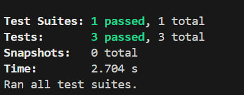
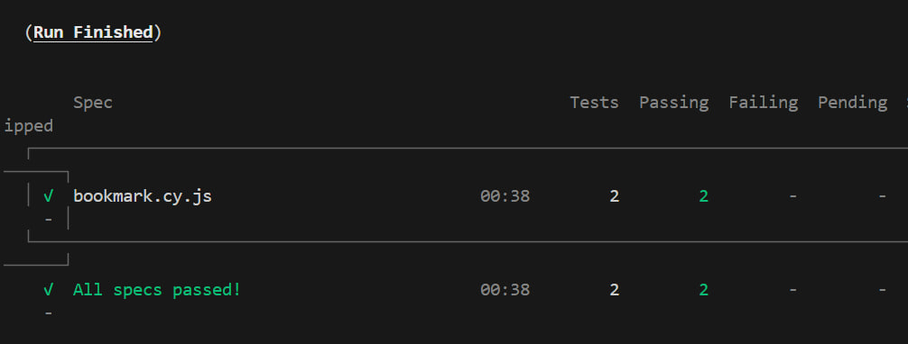
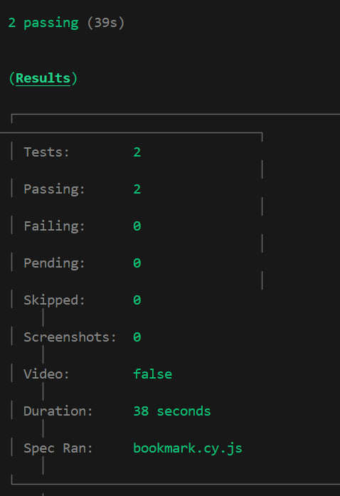

💼 Job Position Listing Application with Bookmark Functionality

📌 Overview

This web application allows users to browse, search, and bookmark job positions. Users can save jobs for later and manage bookmarks directly from job cards.
🔒 Only authenticated users can access the bookmark feature, and the app provides clear feedback for successful or failed actions.

✨ Features

📋 Job Listing – View available job positions with detailed information

🔖 Bookmark Toggle – Bookmark or unbookmark jobs directly from the job card

🔐 Authentication – Bookmarking is restricted to logged-in users only

🔍 Search Jobs – Search job positions by title with accurate results

💬 User Feedback – Notifications for successful or failed bookmark actions

🧪 Testing – Fully tested using Jest (unit & component tests) and Cypress (E2E tests)

🖼️ Test Screenshots (Jest & Cypress)

✅ Jest – Component & Unit Tests Passed

This screenshot shows all Jest unit and component tests passing successfully.

✅ Cypress – Bookmark Feature E2E Test Passed

This screenshot confirms the bookmark and unbookmark flow works correctly from a user’s perspective.
