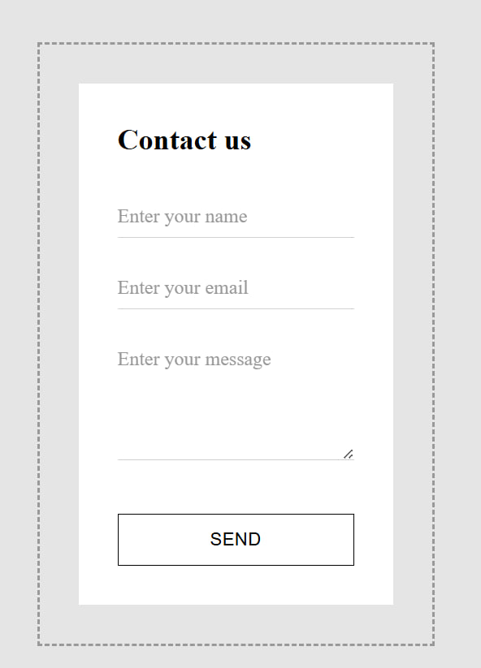
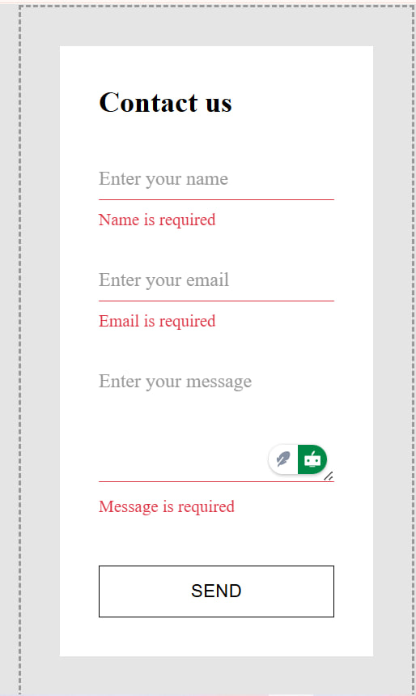
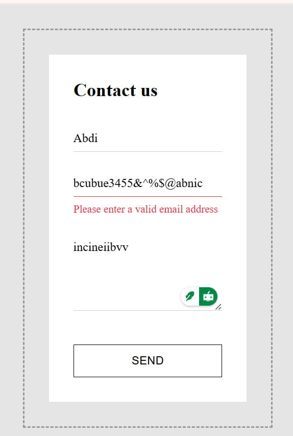
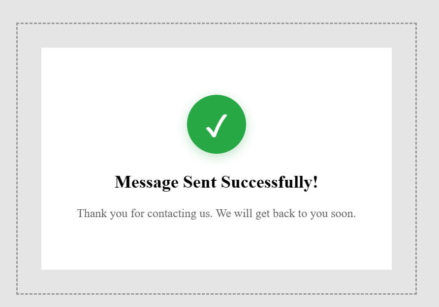

📌 Project Title:

Simple Contact Form using React & Custom useForm Hook

📘 Project Description

This project is a simple and responsive Contact Form built using React and a custom useForm hook.
The form includes:

Name (required)

Email (required + email format validation)

Message (required)

The goal of this task is to demonstrate:

Understanding of React hooks

Managing form state

Creating reusable validation logic

Basic frontend validation

Displaying validation errors

Handling form submission

Creating a clean UI

🧩 Features

✔ Custom useForm hook
✔ Live error validation
✔ Required field checks
✔ Email format validation
✔ Responsive UI
✔ Easy to extend
✔ Clean and reusable structure

### 🏠 Home (Initial View)

When the user first opens the Contact Form, the page looks like this:

- All fields are empty  
- No errors are displayed  
- The user can start typing their information



### ❗ Validation Errors (Empty Fields)

If the user clicks **Submit** without typing anything, the following errors appear:

- **Name is required**
- **Email is required**
- **Message is required**

Each error appears below its respective input field.



### ❌ Invalid Email Error

When the user enters an incorrect email format (example: "hello@" or "abc.com") and clicks Submit,  
the form displays:

**Invalid email format**

This error appears only under the Email field.



### ✅ Successful Submission

When all fields are filled correctly and the user clicks **Submit**, the form submits successfully.

What happens:

- All validation checks pass  
- No error messages are shown  
- A success alert appears (example: “Form submitted successfully!”)  
- The form data is logged in the console  
- The user confirms the form was sent



## 👤 Developer

```text
Name   : Abdi Debela
GitHub : Abdi0947
Email  : debelaabdi3@gmail.com