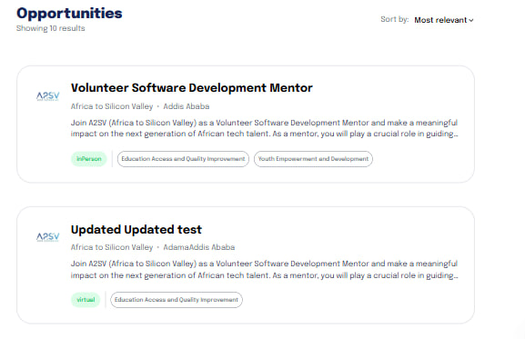
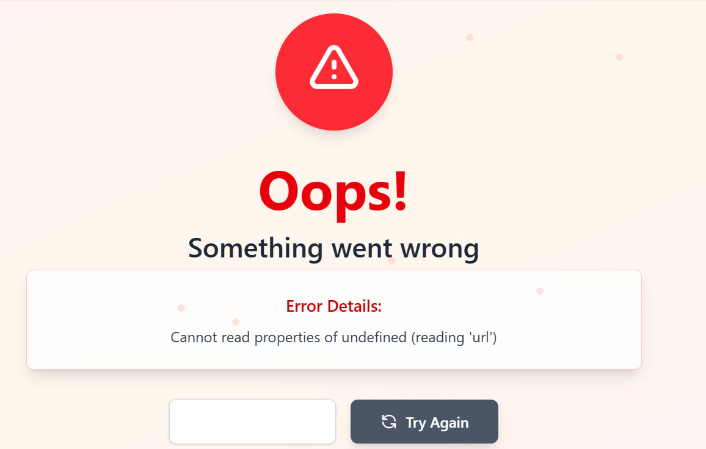

# 🎯 Opportunities App

Fetch and display opportunities from an API in a card-based UI.

## ✨ Features

- 🔄 Fetch opportunities from `https://akil-backend.onrender.com/opportunities/search`
- 🎴 Display each opportunity in a card (title, description, etc.)
- ⚠️ Handle API errors gracefully

## 📦 Installation

```bash
git clone https://github.com/Abdi0947/A2SV-web-Project/integrating_api.git
cd integrating_api
npm install
npm start
```

## 🚀 Usage

- 📊 Data loads automatically from the API.
- 💼 Each card shows relevant opportunity details.
- ❌ Errors are displayed if API requests fail.

## 📸 Screenshots

### ⏳ Loading


### 🏠 Home




### ⚠️ Error


