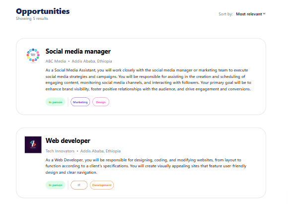
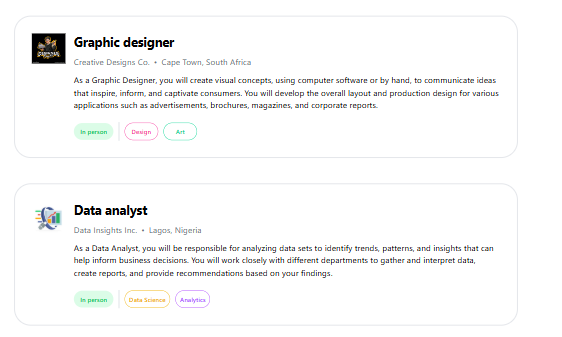
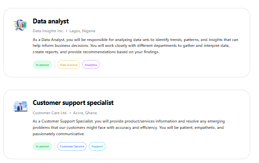
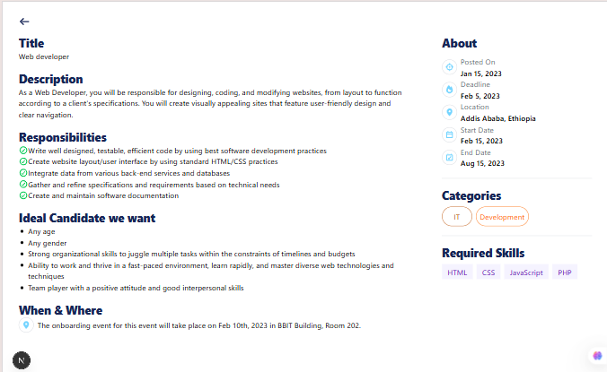

# Job Listing Application - Next.js + Tailwind CSS

## 📌 Overview

This project is a Job Listing Application Dashboard built using Next.js and Tailwind CSS.  
It is developed and maintained by **Abdi Debela**.

This project demonstrates:

- A reusable Job Card component
- A complete Job Listing Dashboard
- Dynamic routing for individual job details
- Error handling for API requests
- UI built with Tailwind CSS
- Responsive design with Font Awesome icons

## 🧠 Technologies Used

- **React** - UI library
- **Next.js 16** - React framework with App Router
- **TypeScript** - Type-safe JavaScript
- **Tailwind CSS** - Utility-first CSS framework
- **Font Awesome** - Icon library
  

## 📥 Installation & Setup

Follow these steps to run the project locally:

1. Install dependencies
```bash
npm install
```
2. Run the development server
```bash
npm run dev
```

The app will run at:  
👉 http://localhost:3000/


## 📚 Learning Objectives

This project helped practice:

- Building reusable components with Next.js
- Using Tailwind CSS for UI design
- **Integrating RESTful APIs with fetch()**
- **Handling API errors and edge cases**
- **Server-side data fetching in Next.js App Router**
- Mapping and transforming API data structures
- Structuring scalable frontend applications using App Router
- Dynamic routing with Next.js

## 🖼 Screenshots

### Home Page - Opportunities Listing

**Description**: The main page displays all available job opportunities fetched from the API. Each job card shows the company logo, job title, organization name, location, description, work nature, and relevant categories. The page includes a header showing the total number of results and a sort dropdown (UI ready for future implementation).



**Features**:
- Displays all opportunities from the API
- Shows company logos from local assets
- Color-coded category tags
- Responsive card layout with hover effects
- Error handling for failed API requests



**Additional View**: Close-up of individual job cards showing the detailed information layout including work nature badges and category tags.



**Header Section**: Shows the "Opportunities" title, result count, and sort dropdown functionality.

### Job Detail Page - Individual Opportunity

**Description**: The detail page shows comprehensive information about a specific job opportunity, including title, description, responsibilities, ideal candidate requirements, location details, posting dates, categories, and required skills. The page includes a back button to return to the main listing.



**Features**:
- Displays all job information in a two-column layout
- Shows responsibilities with checkmark icons
- Ideal candidate section with age, gender, and traits
- About section with posting date, deadline, location, and dates
- Category tags with color coding
- Required skills displayed as badges
- 404 error page for invalid opportunity IDs
