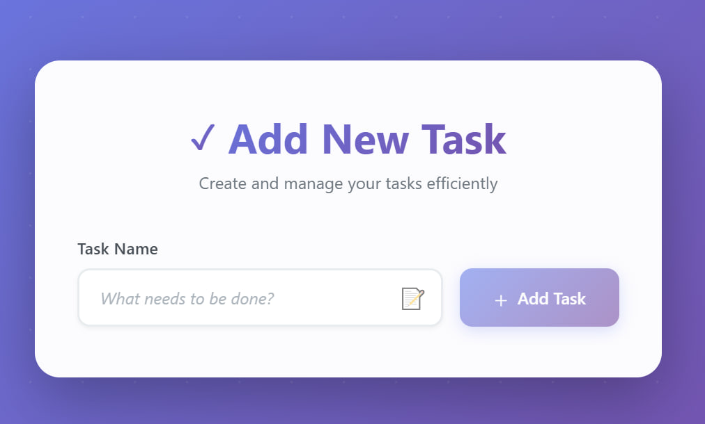
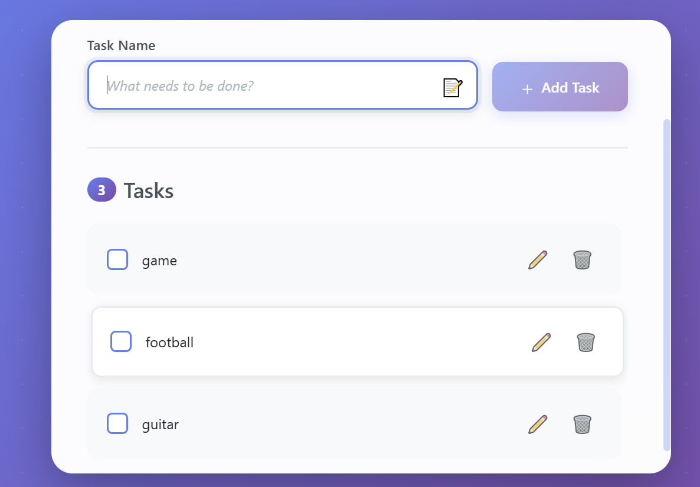
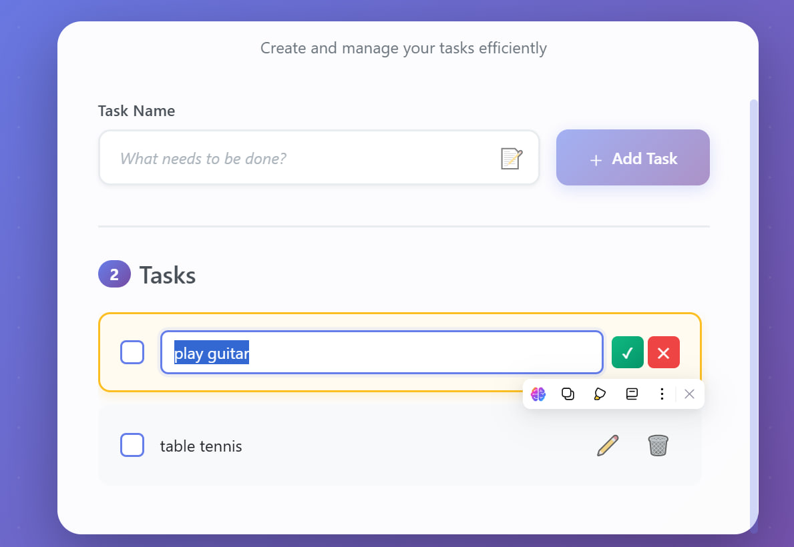
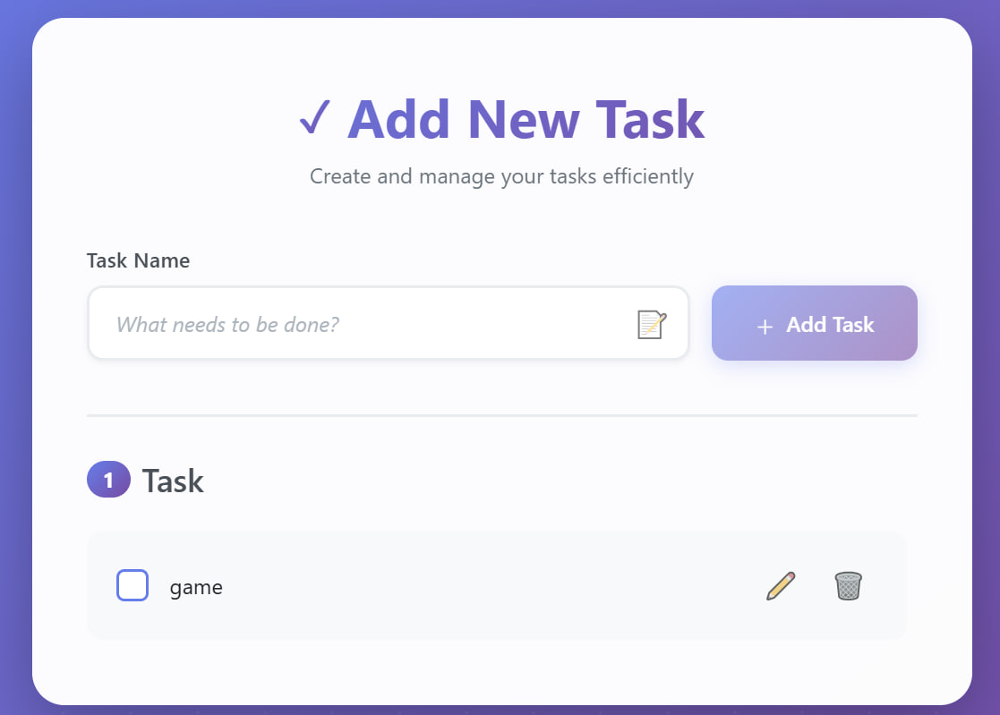

📝 Todo List Form (React + TypeScript + Bootstrap + CSS Animations)

📌 Overview

This project is a modern Todo List application built with React, TypeScript, and Bootstrap 5.
It includes smooth animations, a responsive layout, and a clean UI.
The app allows users to add tasks through an animated input form — and can be easily extended to display and manage todo items.

✨ Features

Home

➕ Add: Create new tasks easily using the input form.

✏️ Edit: Click the Edit button beside any task — the selected task appears in the input field, ready to be modified.

❌ Delete: Instantly remove a task by clicking the Delete button.

🎨 Animated transitions with focus, hover, and entry effects.

📱 Fully responsive layout that adapts to any screen size.

🛠️ Technologies Used
React (TypeScript)

Bootstrap 5

CSS3 Animations & Transitions

Vite / Create React App

📂 Folder Structure

src/

│
├── components/

│   ├── TodoForm.tsx

│   ├── TodoForm.css

│   ├── TodoItems.tsx

│   └── TodoItems.css
│
└── App.tsx

💡 All CSS files are stored next to their component for better modularity.

🚀 Getting Started

1️⃣ Clone the Repository

git clone https://github.com/Abdi0947/A2SV-web-Project/todo-list-app.git

cd todo-form

2️⃣ Install Dependencies

npm install

3️⃣ Start the Development Server

npm run dev

4️⃣ Open in Browser

Visit 👉 http://localhost:5173 (or http://localhost:3000)

🧩 Components Overview
🧾 TodoForm.tsx

Handles input field and button for adding new tasks

Includes smooth fade-in and focus animations

Uses Bootstrap grid and custom CSS transitions

📋 TodoItems.tsx

Displays the list of added todos (you can add functionality later)

Designed to match the style and animation of the form

Supports hover and delete animations (optional extension)

🎨 UI Highlights
Centered form with animated entry (fade-in, slide-in)

Input and button perfectly aligned with equal height

Soft card shadow and rounded corners for a modern look

Responsive design for both desktop and mobile

🧠 Future Enhancements

Add state management (useState or Redux)

Implement Edit and Delete actions

Save todos to LocalStorage

Add task completion animations

Integrate Framer Motion for advanced transitions

👨‍💻 Author

Abdi Debela

💼 GitHub: Abdi0947

📧 Email: debelaabdi3@gmail.com
